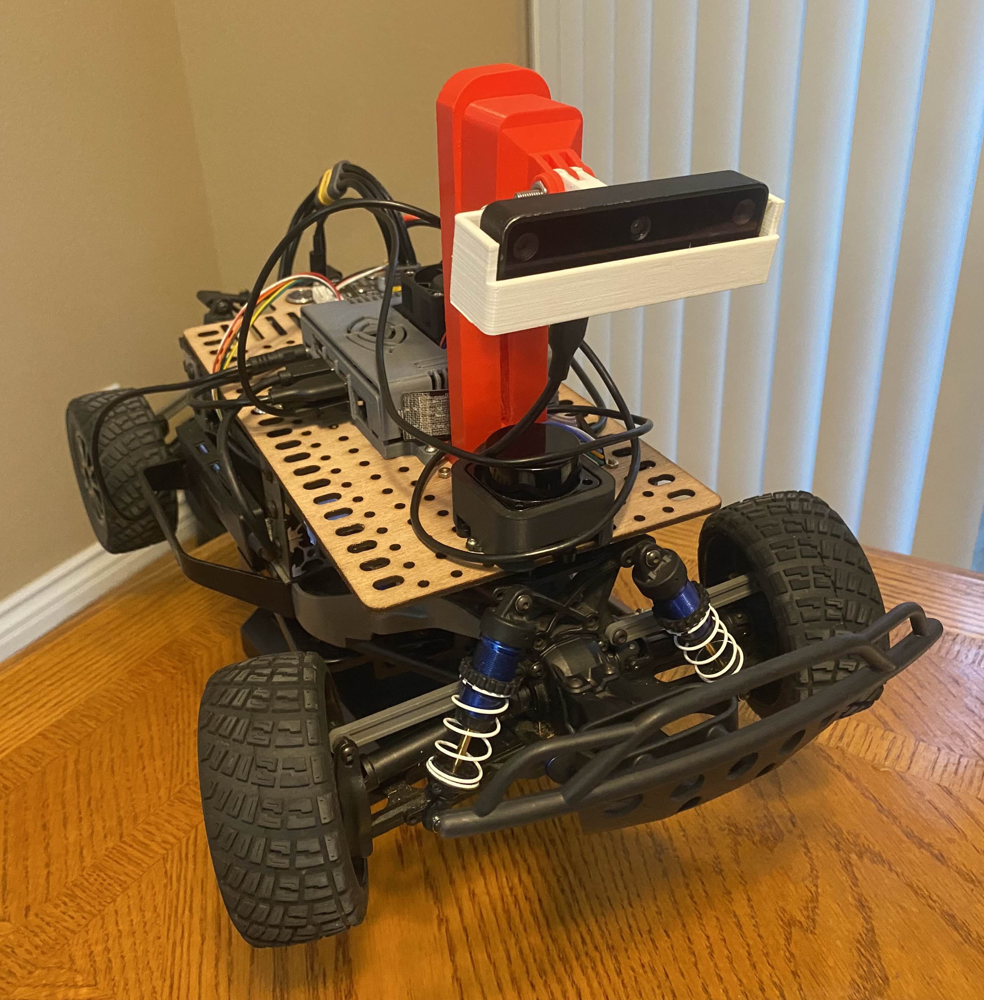

<div id="top"></div>

<h1 align="center">Autonomous Penalty Kick Goalie</h1>

<!-- PROJECT LOGO -->
<br />
<div align="center">
  <a href="https://jacobsschool.ucsd.edu/">
    
  </a>
<h3>MAE148 Final Project</h3>
<p>
Team 1 Fall 2024
</p>


</div>


<!-- TABLE OF CONTENTS -->
<details>
  <summary>Table of Contents</summary>
  <ol>
    <li><a href="#overview">Overview</a>
      <ul>
        <li><a href="#key-features">Key Features</a></li>
      </ul>
    </li>
    <li><a href="#team-members">Team Members</a></li>
    <li><a href="#project-goals">Project Goals</a>
      <ul>
        <li><a href="#core-objectives">Core Objectives</a></li>
        <li><a href="#nice-to-have-features">Nice-to-Have Features</a></li>
      </ul>
    </li>
    <li><a href="#system-architecture">System Architecture</a>
      <ul>
        <li><a href="#node-descriptions">Node Descriptions</a></li>
      </ul>
    </li>
    <li><a href="#technologies-used">Technologies Used</a></li>
    <li><a href="#how-to-run">How to Run</a>
      <ul>
        <li><a href="#prerequisites">Prerequisites</a></li>
        <li><a href="#steps">Steps</a></li>
      </ul>
    </li>
    <li><a href="#future-improvements">Future Improvements</a></li>
    <li><a href="#final-project-documentation">Final Project Documentation</a></li>
    <li><a href="#robot-design">Robot Design</a>
      <ul>
        <li><a href="#cad-parts">CAD Parts</a>
          <ul>
            <li><a href="#custom-designed-parts">Custom Designed Parts</a></li>
            <li><a href="#open-source-parts">Open Source Parts</a></li>
          </ul>
        </li>
        <li><a href="#electronic-hardware">Electronic Hardware</a></li>
        <li><a href="#software">Software</a>
          <ul>
            <li><a href="#embedded-systems">Embedded Systems</a></li>
            <li><a href="#ros2">ROS2</a></li>
            <li><a href="#donkeycar-ai">DonkeyCar AI</a></li>
          </ul>
        </li>
      </ul>
    </li>
    <li><a href="#acknowledgments">Acknowledgments</a></li>
    <li><a href="#contact">Contact</a></li>
  </ol>
</details>

__Note: this document is intended as a high level overview of our project. For more technical/instructional documentation, see ```ball_vision_info.md```__

## Overview

This project focuses on developing a robot car capable of acting as an autonomous penalty kick goalie. Leveraging computer vision (CV) and a DepthAI framework, the robot detects and tracks a soccer ball, calculates its spatial coordinates, and responds to intercept the ball. Using a YOLO object detection model, the system calculates steering and throttle control inputs, and publishes them to the vehicle's VESC (Variable Electronic Speed Controller) using ROS 2.

### **Key Features**
- **Ball Tracking:** Detects and tracks the ball in real time using DepthAI and OpenCV algorithms.
- **Depth and Angle Estimation:** Computes the ball's depth (distance) and horizontal angle relative to the robot.
- **ROS2 Framework:** Publishes and subscribes to relevant data across custom ROS2 nodes for modular functionality.
- **Proportional and Bang-Bang Control:** Implements a proportional controller for accurate steering adjustments and bang-bang control for velocity inputs.
- **Goalkeeper Behavior:** Waits for ball movement before executing intercept maneuvers, mimicking real penalty-kick rules.

---

## Team Members

| Name              | Major                      | Class       |
|-------------------|----------------------------|-------------|
| Abhi Sachdeva     | Electrical Engineering     | Class of 2025 |
| Charles Lahey     | Mechanical Engineering     | Class of 2025 |
| Evan Gibson       | Mechanical Engineering, Ctrls & Robotics | Class of 2025 |
| Gautam Ganesh     | Mechanical Engineering     | Class of 2025 |

---

## **Project Goals**

### **Core Objectives**
1. **Ball Tracking and Control:**
   - Implement a tracking node that uses DepthAI to:
     - Deploy a YOLO model directly to OAK-D Lite camera, detecting a soccer ball in frame.
     - Measure:
       - `Ball Depth`: Average distance between the ball and the robot in millimeters.
       - `Ball Angle`: Horizontal offset angle from the robot's center.
   - Publish data to VESC BLDC Motor Controller:
       - ```throttle``` variable via bang-bang controller.
       - ```angle``` variable, represent's angular offset between ball and car, normalized between -1 and 1 using camera's horizontal FOV. 

3. **Goalkeeper Rules:**
   - Ensure the robot remains stationary until the ball begins moving (mimicking real penalty-kick rules).
   - React swiftly to block the ball once it starts moving.

### **Nice-to-Have Features**
- **Path Prediction:**
  - Use ball position and velocity data to predict the trajectory and intercept the ball optimally.
  - Incorporate robot dynamics to determine the ideal intercept point.
  
---

## **System Architecture**

The project leverages a modular architecture, where each node in the ROS2 framework is responsible for specific tasks. 

### **Node Descriptions**

1. **```yolo_node.py```**
   - **Inputs:** Camera feed from OAK-D Lite.
   - **Measures:** 
     - Ball Depth: (distance in mm).
     - Ball Angle: (horizontal angle between ball and camera in radians or degrees).
   - **Outputs:**
     - Twist messages to the ```\cmd_vel``` topic
     - ```linear.x``` messages represent throttle commands
     - ```angular.z``` messages represent servo commands. These message are Ball Angle data normalized between -1 and 1.

2. **```vesc_twist_node.py```**
   - **Inputs:** 
     - ```linear.x``` and ```angular.z``` messages from the ```yolo_node.py```.
   - **Outputs:**
     - Commands to the VESC for motor control.

---

## **Technologies Used**

- **DepthAI:** For object detection, depth estimation, and spatial tracking of the soccer ball.
- **OpenCV:** To process image frames and detect circular objects.
- **ROS2:** Middleware framework for data publishing and subscribing between nodes.
- **VESC:** Controls the robot's drivetrain, providing precise throttle and steering.

---

## **How to Run**

__Detailed instructions can be found in ball_vision_info.md__

### **Prerequisites**
- Install ROS2 (Foxy recommended).
- Set up the DepthAI SDK.
  - In Docker container ```projects``` directory
  ```bash
  git clone https://github.com/luxonis/depthai-python
  ```
- Ensure the VESC is configured and calibrated.

### **Steps**
1. In Docker container, run ```source_ros2```
1. Enter the ```src``` directory and clone the repository:
   ```bash
   cd src
   git clone https://github.com/UCSD-ECEMAE-148/fall-2024-final-project-team-1/tree/main
   cd ..
   ```
2. Build the ROS2 workspace:
   ```bash
   colcon build --packages-select ball_vision_package
   ```
3. Launch the system:
   ```bash
   ros2 launch ball_vision_package ball_tracking.launch.py
   ```
   
## **Future Improvements**

- Integrate a path prediction algorithm for smarter ball interception.
- Enhance the PID controller for faster and smoother responses.
- Explore deep learning-based ball detection for improved accuracy in varying lighting conditions.


### Final Project Documentation

* [Final Project Presentation](https://docs.google.com/presentation/d/1sWPAhDD-GJ9jYpHarSCKPhVNQmTzqOHTQWOG0NPXQyo/edit?usp=sharing)
* [Project Proposal](https://docs.google.com/presentation/d/1Lm3S6NN71KebaZToWxZiezmuwGJY3F4DBKpGaalPcTA/edit?usp=sharing)

<!-- Early Quarter -->
## Robot Design

### CAD Parts

#### Custom Designed Parts
| Part | CAD Model | Designer |
|------|--------------|------------|
| Camera Mount |  | Evan
| LiDAR Case |  | Gautam


#### Open Source Parts
| Part | CAD Model | Source |
|------|--------|-----------|
| Jetson Nano Case |  | [Thingiverse](https://www.thingiverse.com/thing:5237669) |
| Oak-D Lite Case |  | [Thingiverse](https://www.thingiverse.com/thing:3518410) |


### Electronic Hardware
Circuit Diagram of the electronic hardware setup for the car.


### Software
#### Embedded Systems
Our team utilized a wirless SSH to a Jetson Nano that contained a docker container with all the necessary packages and dependecies used to run our program in a ROS2 workspace. SSH was done via both Mac terminal and Windows PC with Virtual Machine.

#### ROS2
The Docker Images, which were provided to us and pulled from the Docker Hub, contained the UCSD Robocar Module along with the ROS/ROS2 submodules that we utilized during project prototyping and lane following.
The UCSD Robocar Module, running on Linux OS (Ubuntu 20.04), was initially developed by Dominic Nightingale, a graduate student at the University of California, San Diego

<!-- ACKNOWLEDGMENTS -->
## Acknowledgments
*Thank you to Professor Jack Silberman and our incredible TA's Alexander, Winston, and Vivek for an amazing Fall 2024 class! Thank you also to [@kiers-neely](https://github.com/kiers-neely) for the amazing README.md template.*

<!-- CONTACT -->
## Contact

* Abhi Sachdeva | asachdeva@ucsd.edu
* Evan Gibson | egibson@ucsd.edu
* Charlie Lahey | clahey@ucsd.edu
* Guatam Ganesh | gganesh@ucsd.edu
